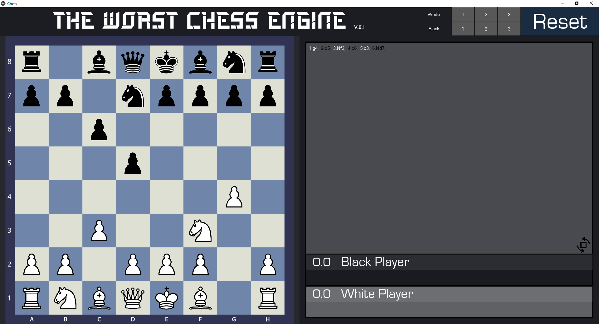

# ChessApp

# Software Requirements Specification (mini-Version)
## 1. Introduction
### 1.1 Purpose
The purpose of this document is to build an application to play chess on a computer or phone against yourself or an engine.

### 1.2 Intended Audience
This Application will only be used by the developer.

### 1.3 Project Scope
The purpose of this Application is to introduce myself to software development, practice object-oriented programming, code-orginization and GUI-Programming. By no means is this a polished application. It has plenty of optimization potential and will only have basic functionalities and simple engine-opponents.

## 2. Overall Description
### 2.1 Product Perspective
+ **Chess Board:**
  The Application will show a complete chessboard with all regular white and black chesspieces. Pieces can be moved according to the rules of the game. If one player wins, the game will be restarted.
+ **Game Score:**
  It includes a score, showing which player has performed better since the start of the application.
+ **Game Hiytory:**
  All moves that were made in one game will be shown in common chess notation.

### 2.2 Product Features
+ Pick-and-Place moving of Pieces
+ Board rotation
+ Display of taken pieces
+ Display of current score
+ Automatic detection of a win by checkmate or draw by repitition/insufficient material/stalemate
+ Options for playing aganist an engine (3 difficulties)

### 2.3 User Functions
+ Making a move
+ Choosing an engine difficulty
+ Rotating the board
+ Restarting the game

### 2.4 Operating Environment
+ Client system
+ Operating system: Windows, Linux, Android

### 2.5 Product Design annd Implementation
The frontend-design witll be a simple GUI-Implementation in a model-View-Controller(MVC) Pattern with kivy. Implementation of all the functionality at backend will be from scratch and without checking for solutions other developers used to implement a chess game. Its main purpose is practice of the in 1.3 mentioned Topics, so it won't be optimised regarding computation speed and engine quality.
